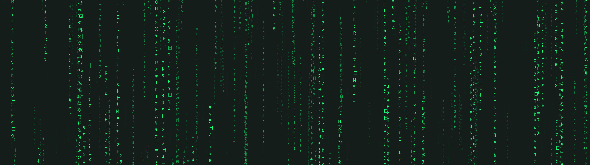

# Matlock

<div align="center">
    <h1></h1>
</div>

**Matlock**, or Matrix Lock, is a screen lock program for X and Wayland written
in C++. Initially a fork of the original C implementation
[`slock`](https://tools.suckless.org/slock/), it has undergone considerable
restructuring and revamping.

The backend is chosen at runtime:

* under a Wayland session (`WAYLAND_DISPLAY` set), the session is locked through
  the [`ext-session-lock-v1`](https://wayland.app/protocols/ext-session-lock-v1)
  protocol (supported by niri, sway, river, Hyprland, KWin, and other
  wlroots-based compositors);
* otherwise, the X11 backend is used (`DISPLAY` set).

## Installation

This package is available through `yay`:

```sh
yay -S matlock
```

The binary file is available in
[Releases](https://github.com/sujaltv/matlock/releases).

Alternatively, the binary file can be generated by [compiling the source code
manually](#manual-build).

## Usage

Matlock can be started from the command line interface by issuing the command
`matlock`, or a keybinding may be created.

```sh
# lock screen
matlock

# manual
man matlock

# help
matlock -h
```

## Configuration

Matlock reads `/etc/matlock.yaml` and then per-user overrides from
`$XDG_CONFIG_HOME/matlock/matlock.yaml` (usually
`~/.config/matlock/matlock.yaml`). Both files are watched while the screen is
locked and changes apply live. Only a flat `key: value` YAML subset is
supported; see the installed `/etc/matlock.yaml` for a commented example.

| Key                                | Default      | Purpose                                                                                                                                                                  |
| -                                  | -            | -                                                                                                                                                                        |
| `background`                       | `"#141D1A"`  | background colour                                                                                                                                                        |
| `font_pattern`                     | `monospace`  | fontconfig pattern for the rain glyphs (both backends)                                                                                                                   |
| `font_size`                        | `20`         | pixel size of the closest rain layer (10..128); farther layers interpolate linearly down to 10                                                                           |
| `depth_levels`                     | `4`          | number of depth layers (1..8); closer layers are larger, brighter, faster and longer                                                                                     |
| `max_droplets`                     | `1000`       | size of the droplet pool (16..20000)                                                                                                                                     |
| `droplet_length`                   | `50`         | longest stream in characters (2..200)                                                                                                                                    |
| `spawn_attempts`                   | `1`          | spawn attempts per simulation step (1..32), 1-in-5 chance each; main rain-density knob                                                                                   |
| `fps`                              | `20`         | animation frame rate (10..120); the simulation is rescaled so on-screen speed is identical at any rate                                                                   |
| `idle_timeout`                     | `0`          | seconds without input before the animation freezes at ~0% CPU (0..86400, 0 disables, the default)                                                                        |
| `hidpi`                            | `true`       | render at full buffer scale on HiDPI outputs; false upscales from scale 1 (Wayland only)                                                                                 |
| `charset`                          | `A-Z 0-9 … ` | characters the streams are made of (any UTF-8 characters, 1..1024, no blanks); for a character the font in font_pattern does not have, a fallback font that does is used |
| `mutate_chars`                     | `true`       | characters in falling columns mutate                                                                                                                                     |
| `failonclear`                      | `false`      | treat cleared input as failed (colour)                                                                                                                                   |
| `fontcolour.[init\|input\|failed]` |              | rain colours per state (`"#RRGGBB"`)                                                                                                                                     |

The user and group privileges are compile-time settings defined in
`include/config.hpp`.

## Manual build <a name="manual-build"></a>

### Requirements

* Tools:
    * A modern C++ compiler (such as `g++`; 14.0.0 or newer)
    * `make` (4.4.0 or newer)
* Libraries:
    * The [X Library](https://www.x.org) (a.k.a.
      [`Xlib`](https://www.x.org/releases/current/doc/libX11/libX11/libX11.html)
      or `libX11`), pointed to by the `Make` variables `X11INC` and `X11LIB`
    * [libcrypt](https://github.com/besser82/libxcrypt/), pointed to by the
      `Make` variable `CRYPTLIB`
    * For the Wayland backend (`Make` variables `WLINC` and `WLLIB`):
      [`wayland-client`](https://wayland.freedesktop.org),
      [`wayland-protocols`](https://gitlab.freedesktop.org/wayland/wayland-protocols)
      and `wayland-scanner` (build-time),
      [`libxkbcommon`](https://xkbcommon.org), [FreeType](https://freetype.org)
      and [Fontconfig](https://www.freedesktop.org/wiki/Software/fontconfig/)

### Compilation

Download or clone a copy of the source code from
[GitHub](https://github.com/sujaltv/matlock).

```sh
# via https
git clone https://github.com/sujaltv/matlock.git

# via ssh
git clone git@github.com:sujaltv/matlock.git
```

Refer to [`Makefile`](Makefile) to see all the Make recipes available; refer to
[`Makevars.mk`](Makevars.mk) to configure build settings such as compilation
flags and the build and installation directories.

```sh
# instal afresh
sudo make clean instal

# uninstall
sudo make uninstall
```

By default,

* the build files are created in `$TMPDIR/matlock` and can be changed by setting
  the variable `BUILD_DIR`;
* the installation directory is `PREFIX` (likely `/usr/`);
    * the binary file will be located in `PREFIX/bin`;
    * the user manual will be located in `PREFIX/share/man/man1`; and
    * the licence file and other files, if any, will be located in
      `PREFIX/share/licenses/matlock`
